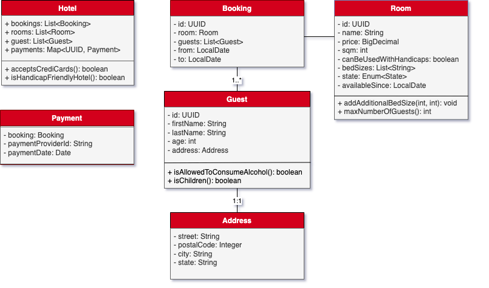

# EclipseStore Demo Projects

This repository contains backend services to demonstrate the usage of [EclipseStore](https://eclipsestore.io) as persistence framework.

Each component has its own Markdown file that explains the basic stuff like build and deploy.

## sb-hotel
Using SpringBoot framework for building a backend service.

## Class Diagram
